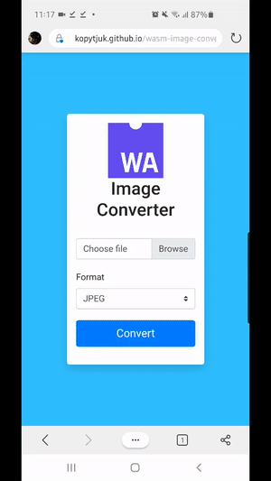

# Web assembly image converter

Website link: [TRY IT OUT](https://kopytjuk.github.io/wasm-image-converter/website/index.html)

This repo contains a simple image converter (PNG ↔ JPG) using WASM technology and C++ code.

Features:

- client-side multiplattfom C++ logic execution in browser (x86/ARM, Windows/MacOS/Linux)
- extensible to other (exotic) formats like `PNM` or `TIFF`, see [here](https://www.boost.org/doc/libs/1_72_0/libs/gil/doc/html/io.html) (section "Supported Image Formats)

## Technologies & Tools

- Web assembly
- Bootstrap
- Emscripten compiler (em++/emcc)
- VS Code

## Rationale

There are various image converters on the net which can be implemented one of the following way:

- send the files to the server, where the conversion logic is implemented
- JS client-side conversion via `canvas` drawing and export functionality, see [Centipede5/imageconverter](https://github.com/Centipede5/imageconverter).

However this implementation serves as a technology test for a certain task.

## How to build

### CLI

1. Install [boost](https://www.boost.org/doc/libs/1_62_0/more/getting_started/unix-variants.html) library
2. [Build](https://www.boost.org/doc/libs/1_62_0/more/getting_started/unix-variants.html#prepare-to-use-a-boost-library-binary) shared libraries for `boost::filesystem` and `boost::gil`
3. Run `make build` in the root directory. The executable is in `build` directory.

### Web

1. Install [Emscripten SDK](https://emscripten.org/docs/getting_started/downloads.html)
2. Activate emscripten for current terminal session (e.g. `source ~/emsdk/emsdk_env.sh`)
3. In order to build `libjpeg` static library go to `build/include` and run `emconfigure ./configure` and `emmake make`.
4. In the root folder: `make wasm_page` to build `wasm` artifact and corresponding `.js` code.
5. Run an HTTP server in [website/](website/)
6. Enjoy!

## License

MIT